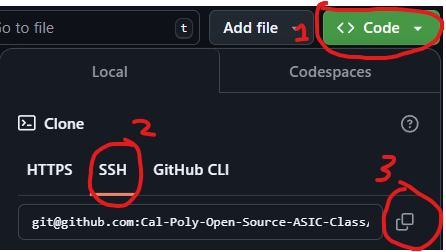

Welcome to your first lab in Open Source ASIC Design!

# Getting Started
At this point, you should have followed the [Docker Installation](https://github.com/Cal-Poly-Open-Source-ASIC-Class) instructions and have already cloned the [Asic Tools](https://github.com/Cal-Poly-Open-Source-ASIC-Class/asic-tools) repository. 

- Start by __forking__ this repository, __not__ cloning it. This will create a copy that you own.
- Then, clone your forked copy into the `workspace`  folder. In other words, `cd` into `asic-tools/workspace`, and then `git clone <your forked copy>`
>#### Forking:
>

>#### Cloning:
>

## Using the Tools
### Installing Container
All of the tools you need are bundled in a docker container. To install that container for the first time, `cd` into this repository, run the install script, and log out:
```
sudo ./install.sh
logout
```
### Using Container
 To enter the container, `cd` into this repository and type:
```./run.sh``` 

On success, you should be logged into the docker container, and be in the workspace directory. Make sure any files you create are saved somewhere in the workspace.


> [!CAUTION]
> The workspace directory in the docker container is linked to the workspace folder in the current directory. Any files created in the docker but outside the workspace will NOT persist and will be deleted.

